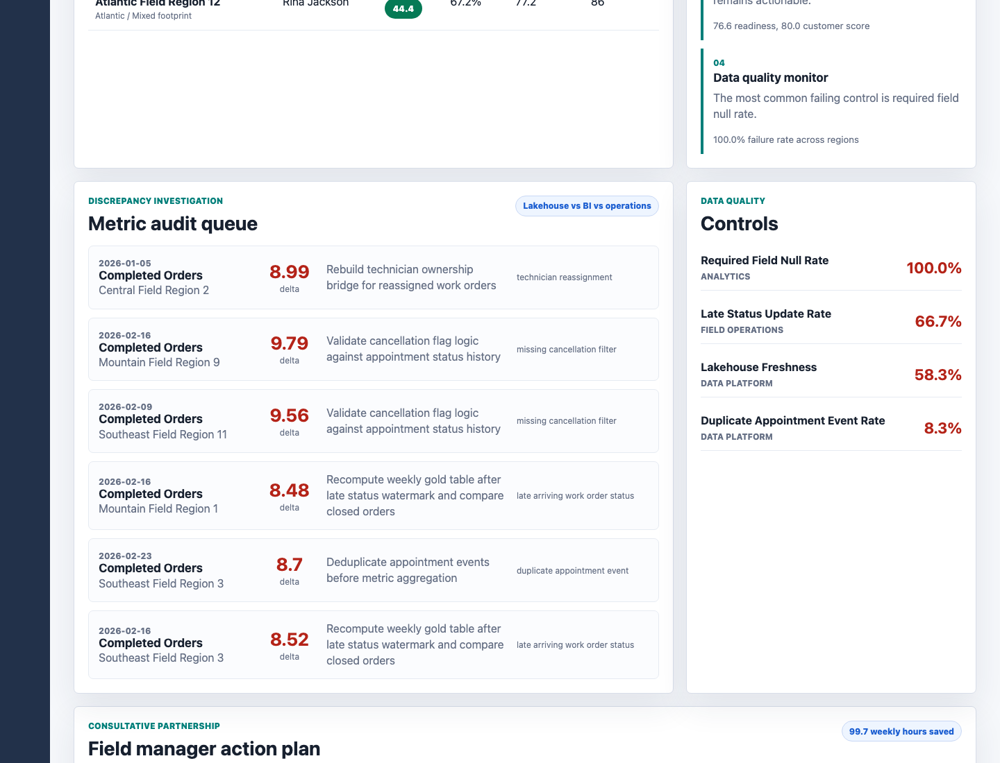
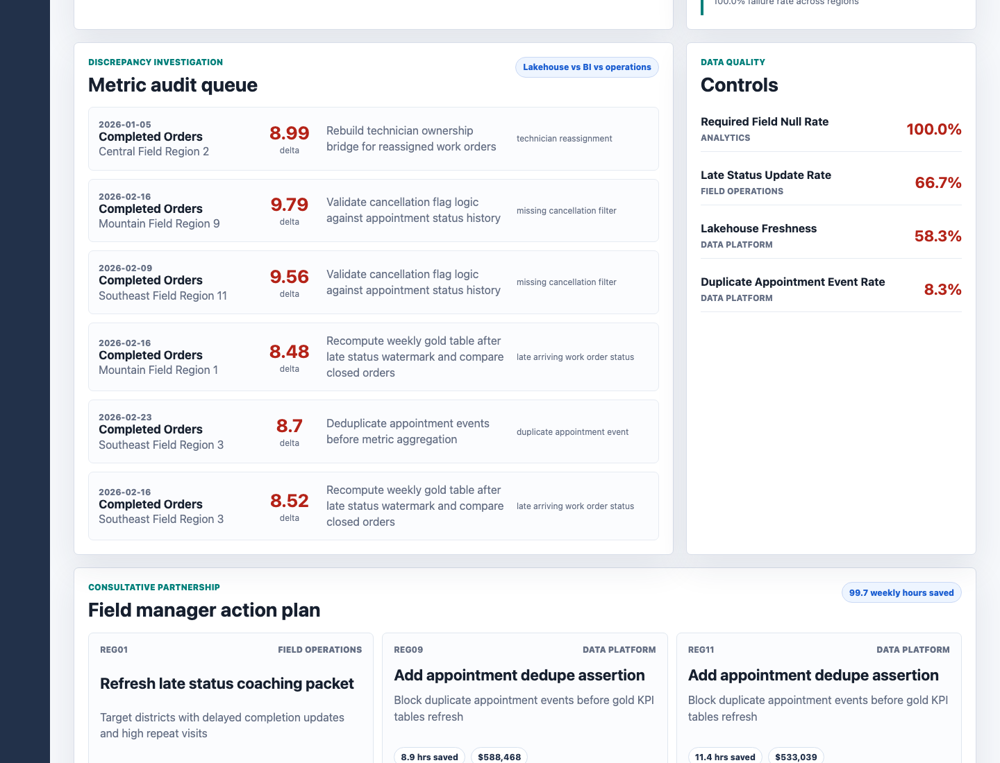
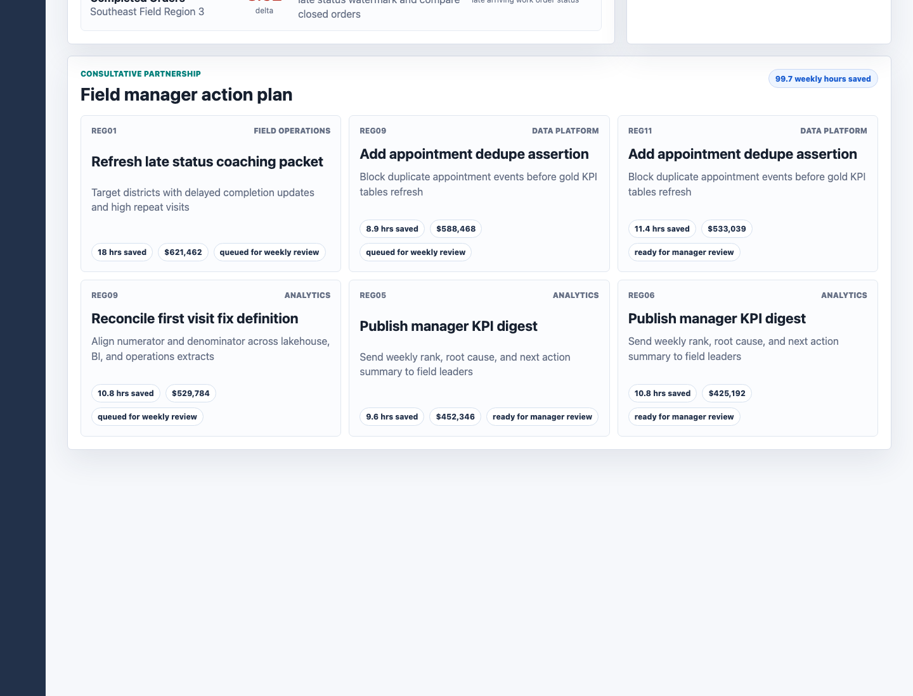

# Field Service Lakehouse KPI Control Tower

An interactive field-service analytics artifact for a nationwide in-home installation and repair operation. The project shows how a data analyst can turn lakehouse tables, reporting discrepancies, data-quality checks, and field manager feedback into a KPI control tower with a defensible action queue.



The executive cockpit summarizes operating health, trusted KPI coverage, open reconciliation issues, and the highest-priority regions for manager review.



The discrepancy audit queue compares lakehouse, BI, and operations extracts, then tags the likely source of each mismatch so analysts can resolve KPI misalignment before leadership review.



The action plan converts analytical signals into field manager recommendations with owners, expected weekly hours saved, and estimated cost avoidance.

## What This Project Demonstrates

- Lakehouse-style KPI modeling for field service work orders, technician capacity, appointment reliability, and customer experience.
- Databricks-style notebook thinking, including bronze to silver volume checks, gold KPI reconciliation, and metric trust controls.
- Discrepancy investigation across reporting platforms before dashboards are treated as decision-ready.
- Executive storytelling that turns statistical and operational trends into manager-ready recommendations.

## Data

All data is deterministic synthetic data generated by `scripts/score_operating_data.py`. It does not represent real company performance, customer records, technician records, or private operational data.

The synthetic data is modeled on common field-service structures:

- `data/entities.csv`: 12 regional field operation records with division, market type, manager, technician count, district count, and drive-time context.
- `data/daily_metrics.csv`: 1,512 region-day KPI rows covering work orders, completion rate, first visit fix rate, repeat visit rate, on-time arrival, technician utilization, overtime, customer score, cost per work order, and row-count controls.
- `data/reporting_extracts.csv`: 1,296 weekly KPI extracts comparing lakehouse, BI report, and operations platform values.
- `data/quality_checks.csv`: 48 data-quality checks for freshness, nulls, duplicates, and late status updates.
- `data/recommended_actions.csv`: 44 intervention candidates with owner, effort, expected hours saved, cost avoidance, and status.

The generator uses a fixed random seed, regional market mix assumptions, drive-time penalties, weekday volume patterns, weighted KPI calculations, reporting-source bias, and quality-control thresholds. Re-running the script reproduces the same operating scenario and refreshed outputs.

## Analysis Outputs

- `analysis/outputs/priority_queue.csv` ranks regions by efficiency gap, KPI trust gap, customer impact, and intervention readiness.
- `analysis/outputs/discrepancy_queue.csv` identifies the highest-severity metric mismatches and recommended audit steps.
- `analysis/outputs/data_quality_summary.csv` summarizes check failures by control type and owner.
- `analysis/outputs/notebook_findings.csv` captures the findings an analyst would present after a notebook review.
- `analysis/outputs/app_payload.json` powers the interactive static application.

## Current Findings

- Highest-priority region: Central Field Region 6 with a 55.8 priority score.
- KPI trust risk: 45 metric mismatches and 3 failed quality checks in the top region.
- Largest audit item: completed_orders for Central Field Region 2, with a 8.99 point or unit delta.
- Best near-term action: Refresh late status coaching packet, estimated at 18.0 weekly hours saved and $621,462 cost avoidance.

## Run Locally

```bash
npm run analyze
npm run start
```

Then open `http://localhost:4181`.

## Scope

This is a static public portfolio artifact. It does not connect to live lakehouse tables, Databricks workspaces, AWS storage, BI servers, field-service platforms, customer systems, workforce management tools, or production data. It shows how an analyst can structure KPI reconciliation, data integrity controls, dashboarding, and consultative field recommendations before production implementation.
